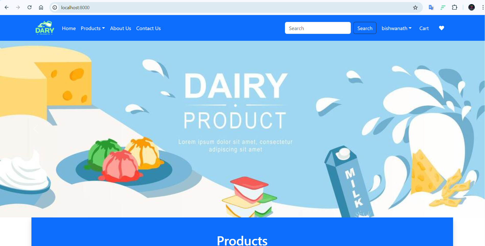
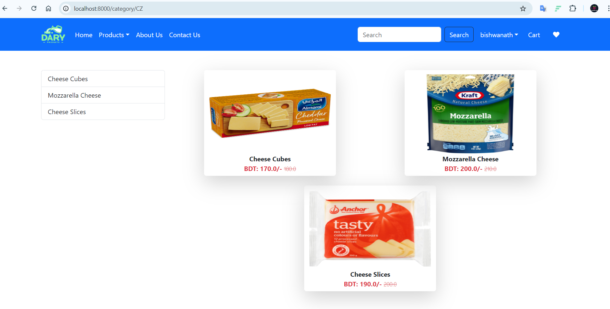
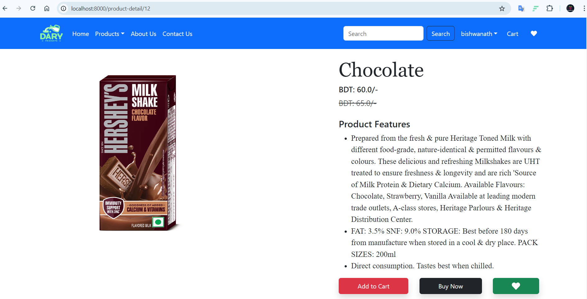
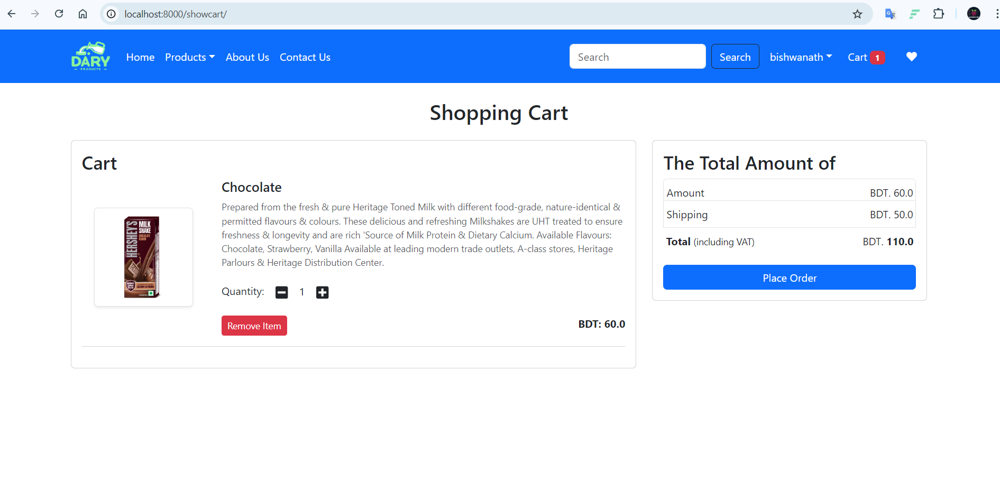
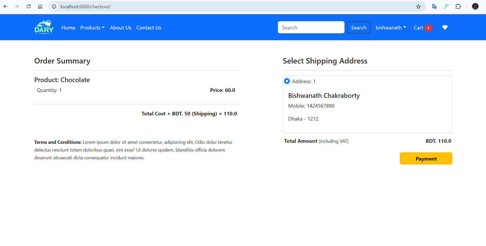

# ecommerce
This is an ecommerce project using Django. Some major option of this project are:-
- User creation and authentication, 
- Add product to cart, 
- Pay online using payment gatway etc.

### Here are some screenshots of the project.

This is the home view of the project.

List of Products of various categories.

Details of the product. You can add to cart.

List of products which are added to cart. 

Plase order to your selectd address and pay your bill via payment gatway!

### Some other features:
* User authentication
* Password Reset
* Monitoring order status
* Search products by name
* Add product to wishlist
* And something more.

*This is learning purpose project. Not for deployment or pruduction level.*